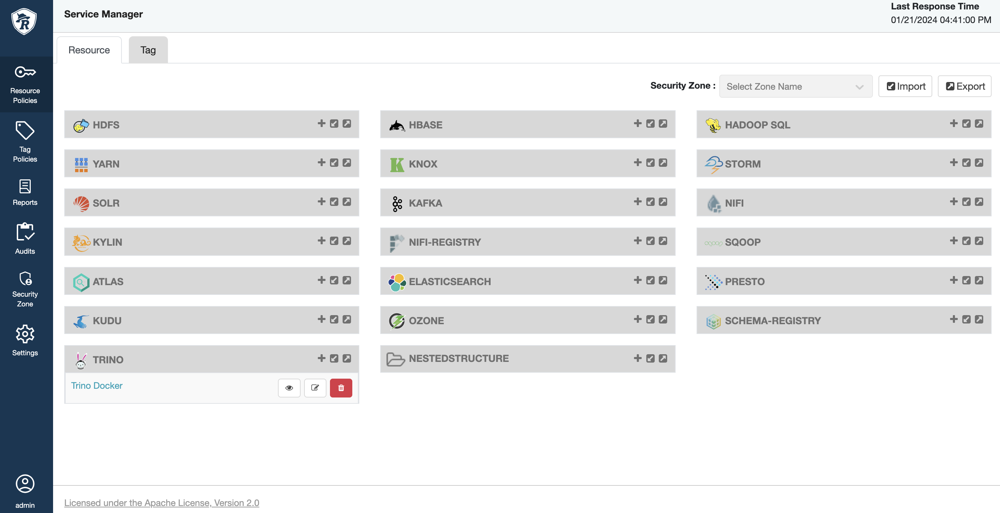
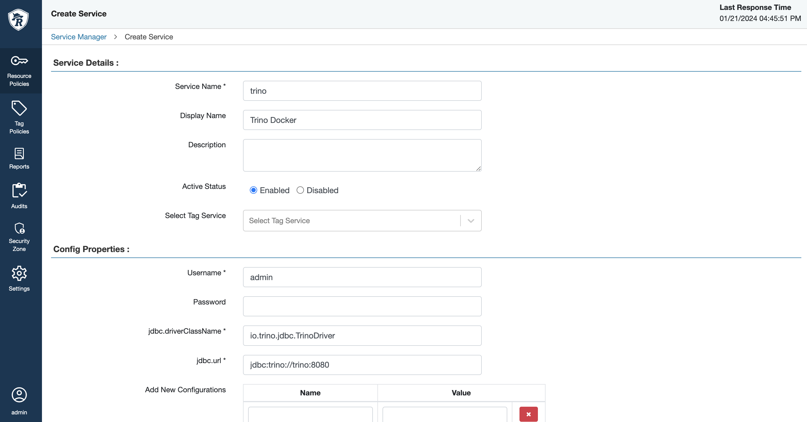
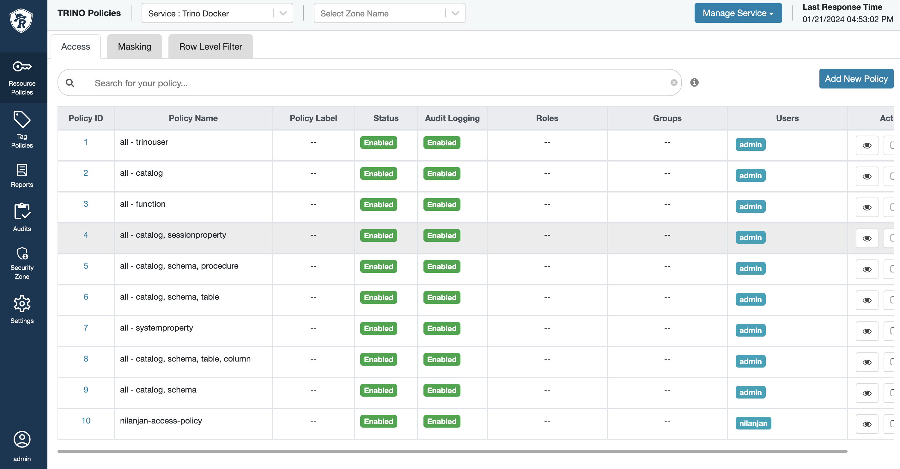
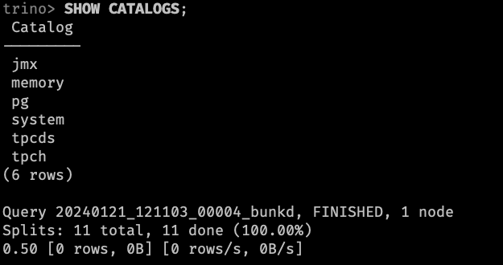
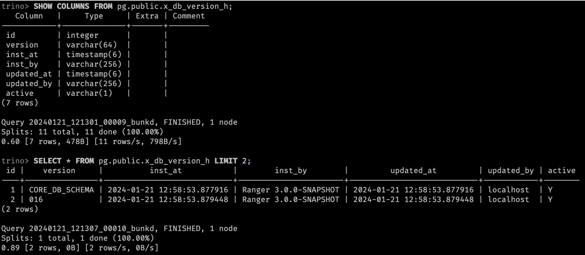
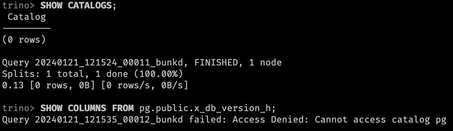
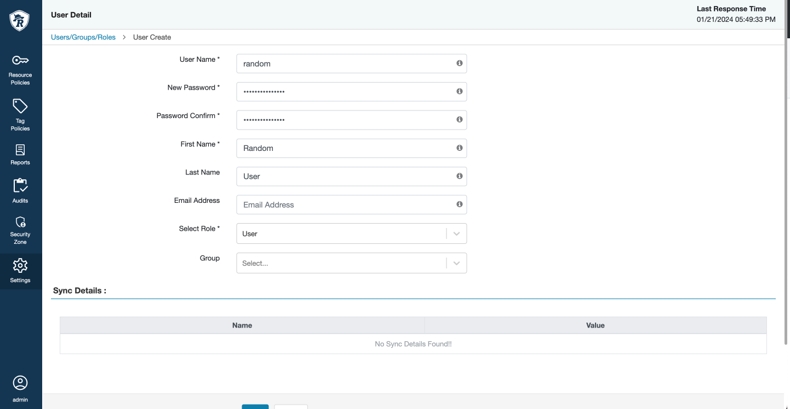
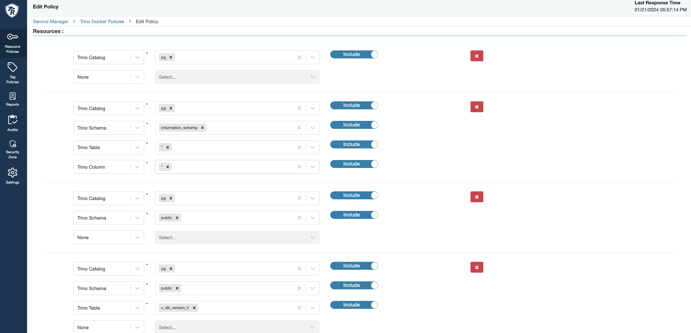
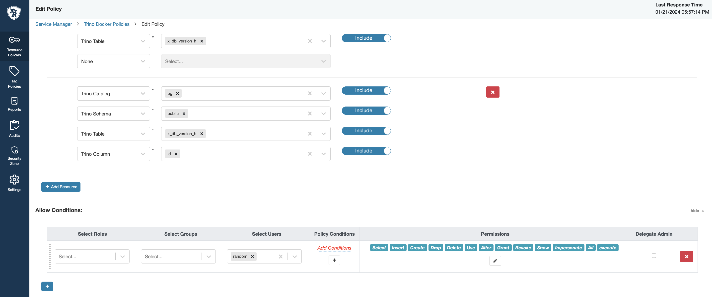
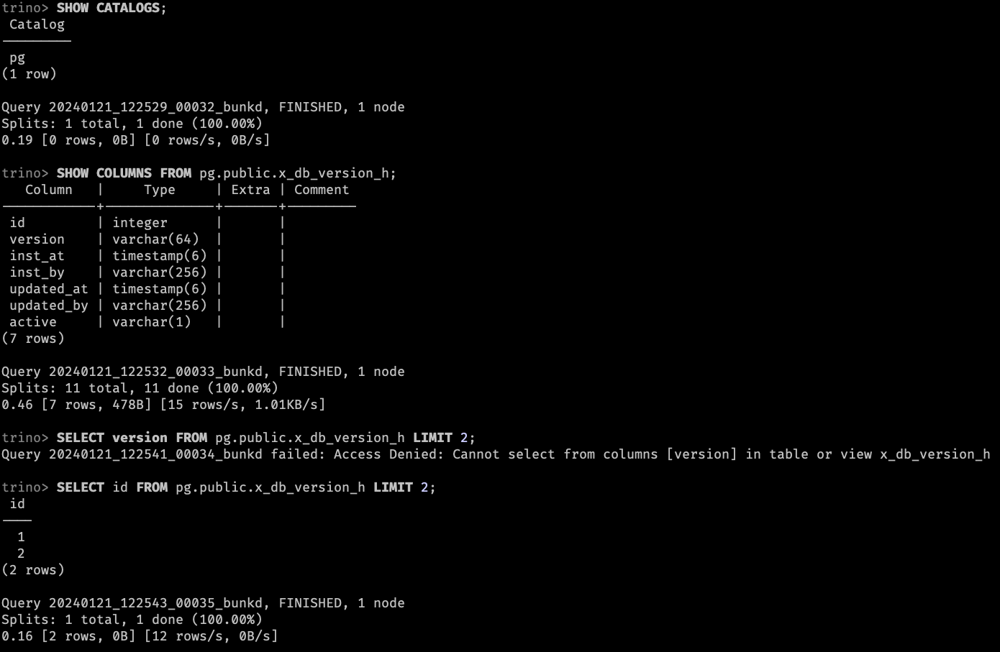

## Apache Ranger integration with Trino

This github repository describes how to integrate Apache Ranger with Trino.

### Considerations

- This integration is only supported for **Trino 433** version
- Used latest **Apache Ranger version (3.0.0-SNAPSHOT)** which is not released yet
- Used latest Apache Ranger Trino plugin which supports Trino 433 version

### Acknowledgements

- An open [#PR](https://github.com/apache/ranger/pull/291) for Apache Ranger Trino plugin raised by [@shreyas-dview](https://github.com/shreyas-dview)
- [@aakashnand](https://github.com/aakashnand) - his Medium article about Apache Ranger integration with Trino. [Medium Link](https://towardsdatascience.com/integrating-trino-and-apache-ranger-b808f6b96ad8)

### Running Trino and Apache Ranger Locally

We need to install `Ranger Admin` and `Ranger Trino Plugin` for this integration. We can build these components from source code but it take ~1 hour to build. So I have build this components and upload on Github. You can download and use it.

#### Build from source code (JDK 17+)

I have used `dview-io:trino-ranger-plugin` branch for Apache Ranger Trino plugin. This branch is not merged with `master` branch yet.

```bash
git clone https://github.com/apache/ranger ranger
```

```bash
cd ranger && git checkout dview-io:trino-ranger-plugin
```

> Following build will take ~1 hour to build. After successful build, you can find `ranger-3.0.0-SNAPSHOT-trino-plugin.tar.gz` file in `target` directory.

```bash
mvn clean compile package install -Pranger-jdk17 -DskipTests
```

> Plugin build will generate trino plugin tar file in `target` directory. You can find `ranger-3.0.0-SNAPSHOT-trino-plugin.tar.gz` file in `target` directory.

```bash
mvn clean compile package install -Pranger-trino-plugin -DskipTests
```

#### Download from Github Releases

- [Apache Ranger 3.0.0-SNAPSHOT](https://github.com/nil1729/trino-ranger-noob/releases/download/3.0.0-SNAPSHOT/ranger-3.0.0-SNAPSHOT-admin.tar.gz)
- [Apache Ranger Trino Plugin 3.0.0-SNAPSHOT](https://github.com/nil1729/trino-ranger-noob/releases/download/3.0.0-SNAPSHOT-trino/ranger-3.0.0-SNAPSHOT-trino-plugin.tar.gz)

#### Running Ranger & Trino with Docker Compose

```bash
docker compose up -d
```

#### Check Ranger Admin UI

You can access Ranger Admin UI at http://localhost:6080. Default username is `admin` and password is `Password123`. You can change the password in `ranger/install.properties` file.



#### Setup Trino Service in Ranger

Make sure you put the service name as `trino`. Otherwise, Ranger Trino plugin will not work. You can find the `service name` in `trino/install.properties` file with key `REPOSITORY_NAME`.



If you test connection with `Test Connection` button, it will fail. Because, we have not configured `Ranger Trino Plugin` yet. Just click on `Add` button to add the service. After adding the service, click on the `Trino Docker` service we have created, you will see the following screen.



#### Testing Ranger Trino Plugin with Trino CLI

You can access Trino CLI with following command. Make sure you login with `admin` user.

```bash
docker exec -it playground trino --server trino:8080 --user admin
```




Let's connect Trino CLI with `random` user.

```bash
docker exec -it playground trino --server trino:8080 --user random
```



#### Create Ranger Access Policy for Trino

Let's create a policy for `random` user. This policy will allow `random` user to access `pg` catalog and `information_schema` schema and only `pg.public.x_db_version_h` table and only `id` column for table `pg.public.x_db_version_h`.

First create a user `random` in Ranger Admin UI.



Create a Access Control policy for `random` user.




Test the Policy with `random` user by connecting Trino CLI.

```bash
docker exec -it playground trino --server trino:8080 --user random
```



---

Made with ❤️ by [nil1729](https://github.com/nil1729)
